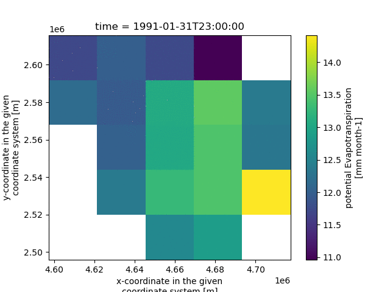
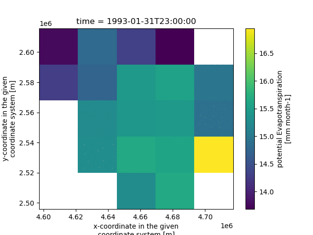

# Autosubmit mHM workflow with mHM test domains data

This repository contains the configuration for an Autosubmit
workflow that runs mHM, the mesoscale hydrological model, using
the mHM test domain data. A Docker container is used to run mHM.

  
  

## Prerequisites

<!--
NOTE: With CWL you can list the software requirements for a computational
      workflow. Unfortunately we do not have the same for Autosubmit. But
      maybe we could find a way to give a specification of requirements?
      CWL can also declare that a workflow or tool needs Internet, and
      even Docker. So everything in this section can be part of the CWL
      Workflow definition. Would be nice to have something we could use
      in Autosubmit (like a standard way of defining it?).
-->

In order to run this workflow you will need the following:

1. Internet connection
2. Linux
3. Autosubmit 4.x
4. Docker & Singularity 3.11.x for containers

For a list of software used, besides `mHM`, see the `Dockerfile`.

## The workflow

An Autosubmit workflow created with
`autosubmit expid -H local -d "mHM" -min -git https://github.com/kinow/auto-mhm-test-domains.git`
when triggered will clone this repository, and prepare the Docker
& Singularity containers, transfer over to the remote platform
(can be `localhost` for testing) and execute the mHM model for
each start date (as the mHM simulation period date). Finally, the
workflow plots the data before cleaning the simulation logs and
files.

The plots are copied back to the local workflow folder, and
everything can be used to package an RO-Crate.

## Running

TODO: document commands used to run and monitor the workflow. It
      must include a step-by-step to re-run the workflow and get
      the same result (i.e. same RO-Crate described at the end.)

## License

TODO: Add OSI license file and link it here.

## RO-Crate

TODO: document the `rocrate.json` used to help populating the
`ro-crate-metadata.json` (partials, with license, author, inputs,
and outputs)…

[autosubmit]: https://autosubmit.readthedocs.io/