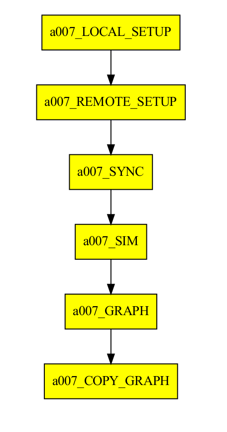

<!--
Licensed to the Apache Software Foundation (ASF) under one
or more contributor license agreements.  See the NOTICE file
distributed with this work for additional information
regarding copyright ownership.  The ASF licenses this file
to you under the Apache License, Version 2.0 (the
"License"); you may not use this file except in compliance
with the License.  You may obtain a copy of the License at

  http://www.apache.org/licenses/LICENSE-2.0

Unless required by applicable law or agreed to in writing,
software distributed under the License is distributed on an
"AS IS" BASIS, WITHOUT WARRANTIES OR CONDITIONS OF ANY
KIND, either express or implied.  See the License for the
specific language governing permissions and limitations
under the License.
-->

# Autosubmit mHM workflow with mHM test domains data

This repository contains the configuration for an [Autosubmit][autosubmit]
experiment that runs [mHM][mhm], the mesoscale hydrological model, using
the mHM test domain data in a workflow. A Docker container is used to install
the dependencies and run mHM.

The two images below were created using the workflow in this
repository, and running the [`plot.py`][plotpy] script (it uses
Xarray and Matplotlib to parse the NetCDF test output).

<div>
  
  
</div>

## Prerequisites

<!--
NOTE: With CWL you can list the software requirements for a computational
      workflow. Unfortunately we do not have the same for Autosubmit. But
      maybe we could find a way to give a specification of requirements?
      CWL can also declare that a workflow or tool needs Internet, and
      even Docker. So everything in this section can be part of the CWL
      Workflow definition. Would be nice to have something we could use
      in Autosubmit (like a standard way of defining it?).
-->

In order to run the workflow you will need the following
prerequisites:

1. Internet connection
2. Linux
3. Autosubmit 4.0.76 (e.g. `pip install autosubmit==4.0.76`)
4. Docker & Singularity 3.11.x for containers
5. password-less `sudo` for the user running Autosubmit (as it will
   try to create the container as part of the workflow)

For a list of software used, besides `mHM`, see the [`Dockerfile`][dockerfile].

> NOTE: You can use `visudo`, for example, to enable password-less
>       `sudo` when building Singularity containers:
>       `<MY-USER> ALL=(ALL) NOPASSWD:/usr/local/bin/singularity`

## Build the containers

To build the Docker container image first, use this command.

```bash
sudo docker build --no-cache=true --tag "auto-mhm-test-domains/mhm:v5.12.1.dev228" .
```

Now, to build the Singularity container, using the Docker container image, use this command.

```bash
sudo singularity build --force mhm.sif docker-daemon://auto-mhm-test-domains/mhm:v5.12.1.dev228
```

**NOTE**: The workflow expects the `mhm.sif` Singularity file to exist in the remote host.

## Workflow

An Autosubmit experiment created with
`autosubmit expid -H local -d "mHM" -min -git https://github.com/kinow/auto-mhm-test-domains.git`
when run will clone this Git repository, and prepare the Docker
& Singularity containers, transfer all the required data over to
the remote platform (it can be `localhost` for testing) and execute
the mHM model for each start date (as the mHM simulation period date).
The last tasks in the workflow will plot the data before cleaning the
simulation logs and files.



The plots are copied back to the local workflow folder, and
everything can be used to package an RO-Crate.

## Running

You will need an Autosubmit experiment first, so that you
can import the configuration files from this Git repository.
Run the following command to create a new Autosubmit experiment.

```bash
autosubmit expid \
    --HPC "local" \
    --description "Autosubmit mHM test domains" \
    --minimal_configuration \
    --git_as_conf conf \
    --git_repo https://github.com/kinow/auto-mhm-test-domains.git \
    --git_branch master
```

This will create a new experiment, using local SSH connections
(as the command is using the default “local” platform), and on
the first execution of `autosubmit create`, it will clone the
Git repository specified and load the configuration from the
subdirectory specified in the `git_as_conf` parameter.

> NOTE: The output of `autosubmit expid` contains the ID of an
>       experiment. Replace `$expid` by that value in the next
>       commands.

The `platforms.yml` file in this repository contains placeholders
like `<USER>`, `<REMOTE_HOST>`, etc., that must be filled in before
the workflow can be used. Alternatively, you can edit your `minimal.yml`
and add the following:

```yaml
# File: ~/autosubmit/$expid/conf/minimal.yml

CONFIG:
  # ...
DEFAULT:
  # ...
  CUSTOM_CONFIG:
    PRE:
      - "%PROJDIR%/conf"
    POST:
      - "~/.config/autosubmit/platforms.yml"
```

And in your `~/.config/autosubmit/platforms.yml`, you can write the
correct values. As an example:

```yaml
PLATFORMS:
  LOCAL:
    TYPE: ps
    HOST: localhost
    USER: kinow
    ADD_PROJECT_TO_HOST: false
    SCRATCH_DIR: /tmp/local/
  REMOTE:
    TYPE: ps
    HOST: localhost
    USER: kinow
    ADD_PROJECT_TO_HOST: false
    SCRATCH_DIR: /tmp/remote/
```

Remember to copy the `mhm.sif` Singularity file to the remote host
scratch directory (`/tmp/remote` in the example above).

The next command is to prepare the experiment workflow (i.e.
parse and validate its configuration and produce a workflow graph,
prepare jobs and scripts, etc.):

```bash
autosubmit create $expid
```

If everything goes well you should see the workflow graph plot
appear on your screen (if you have an X server running). Close
the PDF and now run the workflow with the following command:

```bash
autosubmit run $expid
```

That will execute the complete workflow of your Autosubmit
experiment. If you used `nohup`, or if you have another
command-line terminal, you can monitor the execution of
the workflow with the following commands:

```bash
# plot a new PDF with the progress of your workflow
autosubmit monitor $expid
# print the output logs of your workflow
autosubmit cat-log --file o $expid
# print the error logs of your workflow, in `tail -f` mode
autosubmit cat-log --file o --mode e $expid
```

> NOTE: Autosubmit commands produce log files on disk
>       for traceability. You can increase the log levels
>       with the `-lf` (log file) and `lc` (log console)
>       parameter flags.

And if you are using a version of Autosubmit that supports
RO-Crate, you can create an archive with the provenance
metadata file, the workflow configuration, plots, logs, and
other traces included.

```bash
autosubmit archive --rocrate $expid
```

> NOTE: If you use RO-Crate, you will have to provide a
>       JSON-LD file with extra metadata about your
>       experiment and workflow to have a more complete
>       RO-Crate file (using the Workflow Run Crate Profile).

## RO-Crate

TODO: document the `rocrate.json` used to help populating the
`ro-crate-metadata.json` (partials, with license, author, inputs,
and outputs)…

## License

This workflow is licensed under the Apache License v2. You can
find the complete license at the file [`LICENSE.txt`][license].

The license applies only to the workflow configuration and code,
and not to the rest of the code and tools used.

Please, note that:

- Autosubmit is licensed under the GNU Public License v3.
- mHM is licensed under the GNU Public License v3.

[autosubmit]: https://autosubmit.readthedocs.io/
[mhm]: https://mhm.pages.ufz.de/mhm/stable/
[dockerfile]: ./Dockerfile
[license]: ./LICENSE.txt
[plotpy]: ./plot.py
